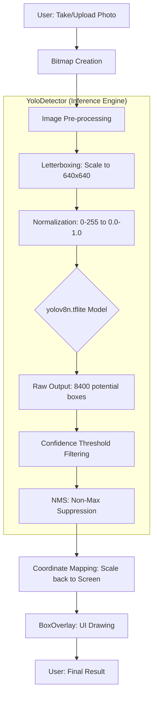

# LiveSense - Real-Time Object Detection

LiveSense is an Android application designed to bring powerful computer vision to your pocket. Using the YOLOv8 (You Only Look Once) architecture, it identifies objects in images, and is expanding towards video and live camera support.

> **⚠️ Project Status Note:** 
> Currently, the **Image Detection** module is fully operational. Taking a photo or uploading an image works perfectly—our model detects and classifies objects with high accuracy. 
> The **Live Camera** and **Video Detection** features are still in the experimental phase and are not yet fully implemented.

## 🛠 Project Structure & Modules

*   **`MainActivity`**: The entry point where users select their detection mode.
*   **`ImageActivity`**: **(Fully Functional)** Manages image selection/capture and coordinates the inference process.
*   **`LiveActivity` & `VideoActivity`**: Currently under development for real-time and file-based video processing.
*   **`YoloDetector`**: The "brain" of the app. It manages the `yolov8n.tflite` model, handles inference, and processes raw data into human-readable detections.
*   **`BoxOverlay`**: A custom view that draws bounding boxes. It translates model coordinates back to the screen so boxes align perfectly with objects in the photo.

## 📐 How It Works (Processing Architecture)

When you capture or upload a photo, the following pipeline is executed:

## 🧠 The AI Model: YOLOv8n

At the heart of LiveSense is the **YOLOv8 Nano (yolov8n)** model. We chose the Nano version specifically for mobile deployment because of its incredible speed and efficiency.

### Model Specifications
- **Architecture:** YOLOv8 Nano (TFLite format)
- **Input Size:** 640 x 640 pixels
- **Parameters:** ~3.2 Million (highly optimized for mobile CPUs/GPUs)
- **Training Dataset:** **Pascal VOC Public Benchmark Dataset**
  - Our model is specialized in detecting **20 common daily object classes** (such as persons, animals, vehicles, and household furniture).
- **Optimization:** Quantized to work smoothly with the Android Neural Networks API (NNAPI) and GPU delegates.

## 🧠 Core Algorithms

### 1. Letterboxing (Preprocessing)
Our YOLO model requires a fixed 640x640 input.
*   **The Problem:** Phone photos are usually 4:3 or 16:9. Stretching them into a square makes objects look distorted, which ruins accuracy.
*   **The Solution:** We scale the image proportionally to fit inside the square and add black bars (padding) where needed. This keeps the objects' shapes natural.

### 2. Non-Maximum Suppression (NMS)
The model is very sensitive and might detect a "person" five times in slightly different spots.
*   **The Problem:** Overlapping boxes make the UI look messy.
*   **The Solution:** NMS looks at these overlaps (Intersection over Union) and keeps only the most confident box, removing the redundant duplicates.

## 🌍 Multilingual Support
We believe technology should be accessible to everyone. LiveSense fully supports multiple languages, automatically translating detection labels:
- **English** (Standard)
- **Hindi** (हिन्दी)
- **Bengali** (বাংলা)
- **Tamil** (தமிழ்)
- **Telugu** (తెలుగు)

## 🚀 Key Problems We Solved
*   **Precision Scaling:** Successfully mapped detections from a 640px buffer back to high-resolution phone screens without misalignment.
*   **Runtime Localization:** Dynamic loading of label arrays based on the system language settings.
*   **Stability:** Optimized memory to handle high-resolution image uploads smoothly.

## 📋 Requirements
- Android Studio Hedgehog+
- Physical Device (recommended for best performance)
- `yolov8n.tflite` placed in `app/src/main/assets`
